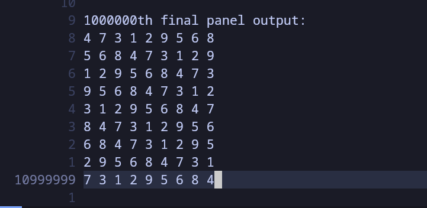

# 结对编程实验报告

## 简介

本文是南开大学《软件工程》课程中“结对编程”作业的实验报告，小组成员包括：

- 卻铭恺，2012411，计算机学院，计算机科学与技术专业，徐思涵老师班
- 刘宇航，2012232，计算机学院，计算机科学与技术专业，李起成老师班

报告内容包括简单的代码介绍，单元测试部分，简单用户手册，质量分析截图和测试覆盖率截图。下面将开始报告的主体部分。

## 简易代码介绍

我们代码的目录结构如下：

```
- build.sh      
- case1.txt     
- case2.txt     
- CMakeLists.txt
+ include (dir) 
  - api.hpp     （前后端耦合API）
  - clipp.h     （参数转换工具）
  - common.hpp  （必备的全局变量声明、宏定义和头文件）
  - gen.hpp     （生成数独相关函数）
  - sol.hpp     （数独求解相关函数）
  - sudoku.hpp  （数独类及方法声明）
- main.cc       （程序入口点， 参数处理相关函数）
- Makefile
- README.md
+ src (dir)
  - api.cc
  - common.cc
  - gen.cc
  - sol.cc
  - sudoku.cc
- test
- test.txt
```

其中，main.cc函数为程序的入口点，在include和src目录下定义着我们的代码主体。每个与hpp文件对应的cc文件装载着hpp中文件声明的定义。

我们代码以命令行作为前端，纯C++语言作为后端，前后端交互的方式通过主函数中对参数的处理代码调用api文件中的参数处理函数来进行。

## 单元测试

针对上述我们实现的主要功能，我们为其编写了单元测试模块，对不同文件中的不同函数进行了单元测试，以确保程序的正确性。

我们使用Google Test框架为我们的程序编写单元测试模块，并将测试模块的内容主要分为三个部分，分别为：

- 生成模块
- 求解模块
- API测试

下面将对其每一部分进行介绍。

### 生成模块
在生成模块中，我们一开始采取了“向九宫格内随机填充一定数量的、满足数独分布定义的随机数”的方法来生成我们的题目，但是这个方法在生成需要填入数字较多的数独时效率较低（源代码中仍含有此函数，不过已弃用，在注释里）。

为了提高效率以满足数独终盘生成、数独谜题生成的数据范围，我们使用了一种“根据排列进行循环移位并随机挖空、打乱”的方法，快速地生成了我们的谜题和终盘。所以，生成模块的工作基本分为两个部分：

- 生成数独终盘
- 生成数独谜题

下面逐步介绍其内容。

#### 生成数独终盘
生成数独终盘的代码在`src/gen.cc:167 fastGenerateSudokuFinal(int sdk_num)`中，其主要逻辑是遍历一个数组的全排列，将其通过特定的线性变换方法进行循环移位，并将其内部特定范围内的行、列随机打乱，最后形成数独谜题的方法。其接收一个数独数量的参数，返回生成的数独数组。函数声明如下：

```c++
vector<Sudoku> fastGenerateSudokuFinal(int sdk_num);
```

虽然这个函数只接收一个参数，但是其内部一些控制变量会通过全局变量去进行传递。比如最小空格数、最大空格数、解的个数、数独难度等等，其定义在`src/common.cc`中，并且在其头文件中声明（包括一个后续需要使用的`n_trigger`变量）：

```c++
extern bool n_trigger;

extern int DIFF;
extern int NUM_NUM;
extern int SPACE_NUM;
extern int MIN_SPACE_NUM;
extern int MAX_SPACE_NUM;
extern int SOLUTION_LIMIT;
extern int SOL_NUM;
```

所以，在后续我们调用API时，只需要方便地更改这些全局变量，就能够控制函数的执行步骤，是一种较为方便的设计。

回到函数本身，其会按照规定数量，生成一个合法的数独终局。在此我们需要进行两种测试，第一种是判定终局是否合法，第二种是判定生成终局的数量是否符合要求。最终设计如下：

```c++
TEST(GenTest, finalLegalTest){
    auto sdks = fastGenerateSudokuFinal(1);
    EXPECT_TRUE(sdks[0].getIsLegal());
}

TEST(GenTest, finalNumTest){
    auto sdks = fastGenerateSudokuFinal(10000);
    EXPECT_TRUE(sdks.size() == 10000);
}
```

#### 生成数独谜题
生成数独谜题的方法，原始的低效方法已经在上文中介绍过了，我们在这里使用了一种牺牲部分题目质量来换取高效率的方法，即在生成终局的基础上挖空生成谜题。也就是说，生成谜题的要求包括这些：

- 生成的谜题必须合法
- 生成的谜题数量需要确定
- 同一次生成的谜题必须不同
- 挖空数量的需要确定（在指定范围内随机），在没有指定的时候根据难度确定挖空数量，在难度也没有指定的时候在默认范围内随机（20~55）
- 生成的谜题的解的数量需要确定

所以针对以上几个需求，我们分别设计测试模块来进行测试。首先是谜题合法的测试：

```c++
TEST(GenTest, legalTest){
    auto sdks = fastGenerateSdk(1, EVERY_SOL);
    EXPECT_TRUE(sdks[0].getIsLegal());
}
```

接下来是谜题数量的测试：
```c++
TEST(GenTest, numTest){
    auto sdks = fastGenerateSdk(100, EVERY_SOL);
    EXPECT_TRUE(sdks.size() == 100);
}
```

下面是谜题不同的测试：
```c++
TEST(GenTest, diffTest){
    auto sdks = fastGenerateSdk(2, EVERY_SOL);
    EXPECT_TRUE(sdks.size() == 2);
    bool different = false;
    for(int i = 0; i < 9; i++){
        for(int j = 0; j < 9; j++){
            if(sdks[0].get(i, j) != sdks[1].get(i, j)){
                different = true;
            }
        }
    }
    EXPECT_TRUE(different);
}
```

再接下来是挖空数量的测试，这两个测试样例分别对应按范围生成和按数字生成（范围为一个数）：
```c++
TEST(GenTest, genSpaceRangeTest){
    MIN_SPACE_NUM = 17, MAX_SPACE_NUM = 37;
    auto sdks = fastGenerateSdk(1, EVERY_SOL);
    int space_cnt = 0;
    for(int i = 0; i < 9; i++) {
        for (int j = 0; j < 9; ++j) {
            if(sdks[0].get(i, j) == 0) space_cnt++;
        }
    }
    EXPECT_TRUE(space_cnt >= MIN_SPACE_NUM && space_cnt <= MAX_SPACE_NUM);
}

TEST(GenTest, genSpaceTest){
    MIN_SPACE_NUM = MAX_SPACE_NUM = 17;
    auto sdks = fastGenerateSdk(1, EVERY_SOL);
    int space_cnt = 0;
    for(int i = 0; i < 9; i++) {
        for (int j = 0; j < 9; ++j) {
            if(sdks[0].get(i, j) == 0) space_cnt++;
        }
    }
    EXPECT_TRUE(space_cnt == MIN_SPACE_NUM && space_cnt == MAX_SPACE_NUM);
}
```

下面是解的数量的测试样例，针对任意个解和唯一解进行测试。需要注意的是，我们认为无解的数独没有意义，所以我们在判定任意解时需要排除掉无解的情况。

```c++
TEST(GenTest, genSolEveryTest){
    MIN_SPACE_NUM = MAX_SPACE_NUM = 17;
    auto sdks = fastGenerateSdk(10, EVERY_SOL);
    for(int i = 0; i < 10; i++) {
        EXPECT_TRUE(!solve(sdks[i]).empty());
    }
}
TEST(GenTest, genSol1Test){
    auto sdks = fastGenerateSdk(10, 1);
    for(int i = 0; i < 10; i++) {
        EXPECT_TRUE(solve(sdks[i]).size() == 1);
    }
}

```

最后，我们还提供了一个格式化输出的测试样例。如下：

```c++
TEST(GenTest, printTest){
    stringstream out;
    streambuf* old_cout_rd = cout.rdbuf();
    streambuf* old_cerr_rd = cerr.rdbuf();
    cout.rdbuf(out.rdbuf());
    cerr.rdbuf(out.rdbuf());

    int arr[9][9] = {
            {0, 0, 1, 8, 0, 0, 4, 2, 7},
            {0, 0, 0, 3, 0, 7, 0, 0, 0},
            {0, 6, 0, 0, 0, 0, 0, 0, 0},
            {0, 0, 0, 0, 0, 0, 2, 7, 8},
            {0, 0, 6, 0, 8, 0, 0, 0, 0},
            {0, 0, 7, 0, 0, 9, 0, 3, 1},
            {0, 0, 0, 0, 0, 0, 1, 0, 5},
            {0, 3, 9, 1, 0, 0, 0, 0, 0},
            {0, 5, 0, 0, 4, 0, 7, 0, 0}};
    Sudoku sdk(arr);
    printSudoku(sdk);

    string s;
    stringstream ss(s);
    for (auto & i : arr){
        for (int j : i)
            ss << j << " ";
        ss << endl;
    }
    ss << endl;
    cout.rdbuf(old_cout_rd);
    cerr.rdbuf(old_cerr_rd);
    EXPECT_EQ(out.str(), ss.str());
}
```

### 求解模块
求解模块采用递归回溯法搜索，在类构造函数中验证题目是否合乎规则，然后从左至右从上至下循环填数，并用值作为下标，以标记在本行、列、宫内数字是否出现，如果无解，则返回上一层。如果数独填满，则一定找到了一个合法的解，压入vector中。
```c++
void cursiveSearch(Sudoku s, int r, int c, std::vector<Sudoku> &solutions)
{
    if (SOLUTION_LIMIT != EVERY_LIMIT && solutions.size() >= SOLUTION_LIMIT)
        return;
    if (r > 8)
    {
        solutions.push_back(s);
        return;
    } // reach row 9th means a correct solution

    if (s.isEmpty(r, c))
    {
        for (int v = 1; v <= 9; v++)
        {
            if (s.set(r, c, v))
            {
                if (c == 8)
                    cursiveSearch(s, r + 1, 0, solutions);
                else
                    cursiveSearch(s, r, c + 1, solutions);
                s.unset(r, c, v);
            }
        }
    } // try every legal number and cursive down
    else
    {
        if (c == 8)
            cursiveSearch(s, r + 1, 0, solutions);
        else
            cursiveSearch(s, r, c + 1, solutions);
    } // no need to put-in
}


```

为了增强复用性，同时处理了读入题目时验证合法性和求解时验证是否可填的布尔判断。
```c++
bool Sudoku::set(int r, int c, int val)
{
    if (val == 0)
        return true;
    if (
        !(
            col[c][val] ||
            row[r][val] ||
            sqr[c / 3 + (r / 3) * 3][val])) // this position is legal
    {

        col[c][val] = true;
        row[r][val] = true;
        sqr[c / 3 + (r / 3) * 3][val] = true;
        item[r][c] = val;
        return true;
    }
    else
    {
        return false;
    }
}
```

求解测试的内容包括：对数独题目的合法性能否检测

```c++
TEST(SolveTest, ilegalTest)
{
    int a[9][9] = {1};
    Sudoku s(a);
    vector<Sudoku> solutions = solve(s);
    EXPECT_EQ(solutions.size(), 0);
}
```
能否正确生成正确数量的解
```c++
TEST(SolveTest, singleTest)
{
    int a[9][9] = {
        {0, 0, 9, 7, 4, 8, 0, 0, 0},
        {7, 0, 0, 0, 0, 0, 0, 0, 0},
        {0, 2, 0, 1, 0, 9, 0, 0, 0},
        {0, 0, 7, 0, 0, 0, 2, 4, 0},
        {0, 6, 4, 0, 1, 0, 5, 9, 0},
        {0, 9, 8, 0, 0, 0, 3, 0, 0},
        {0, 0, 0, 8, 0, 3, 0, 2, 0},
        {0, 0, 0, 0, 0, 0, 0, 0, 6},
        {0, 0, 0, 2, 7, 5, 9, 0, 0}};
    Sudoku s(a);

    vector<Sudoku> solutions = solve(s);
    EXPECT_TRUE(solutions.size() == 1);
    for (auto i : solutions)
    {
        EXPECT_TRUE(i.isSolution());
    }
}

TEST(SolveTest, multiTest)
{
    int a[9][9] = {
        {0, 0, 1, 8, 0, 0, 4, 2, 7},
        {0, 0, 0, 3, 0, 7, 0, 0, 0},
        {0, 6, 0, 0, 0, 0, 0, 0, 0},
        {0, 0, 0, 0, 0, 0, 2, 7, 8},
        {0, 0, 6, 0, 8, 0, 0, 0, 0},
        {0, 0, 7, 0, 0, 9, 0, 3, 1},
        {0, 0, 0, 0, 0, 0, 1, 0, 5},
        {0, 3, 9, 1, 0, 0, 0, 0, 0},
        {0, 5, 0, 0, 4, 0, 7, 0, 0}};
    Sudoku s(a);

    vector<Sudoku> solutions = solve(s);
    EXPECT_TRUE(solutions.size() > 1);
    for (auto i : solutions)
    {
        EXPECT_TRUE(i.isSolution());
    }
}
```
个数上限是否正确（否则可能会导致超时）
```c++
TEST(SolveTest, depthTest)
{
    int a[9][9] = {0};
    Sudoku s(a);

    vector<Sudoku> solutions = solve(s);
    EXPECT_TRUE(solutions.size() <= 10);
    for (auto i : solutions)
    {
        EXPECT_TRUE(i.isSolution());
    }
}
```

### API测试
API测试中，我们对前后端耦合使用的API逐样例、逐情况地进行了测试，实现了行覆盖率的百分百。因为我们的程序支持6个参数，所以我们对每一个参数的处理函数都进行了测试。

#### -c参数
-c和其他参数中，我们的需求中有着对输入的约束，代码中我们使用`assert`函数进行实现，部分实现如下：

```c++
void c_handler(int c)
{
    assert(c >= 1 && c <= 1000000);
    ...
}
```

所以我们在测试样例中，首先对`assert`的各种fail情况进行了全面测试，再对其代码本体进行测试。因为函数内部主要通过调用生成模块的`fastGenerateSudokuFinal()`函数进行操作，所以我们不需要再单独进行测试。最后，-c参数处理函数的测试样例设计如下：

```c++
TEST(apiTest, cTest){
    ASSERT_DEATH(c_handler(-1), "");
    ASSERT_DEATH(c_handler(5000001), "");
    c_handler(100);
}
```

#### -s参数
-s参数中有多种情况，首先我们从`s_handler`的设计逻辑出发：

- 打开指定文件；
- 将其内容读取到内部的数组a中，必要时抛出异常；
- 使用构造函数创建`Sudoku`实例，并将其存入vector；
- 对vector中存放的数独进行求解。

其中，存入vector、数独求解、构造函数我们不需要在这里测试，但是需要测试打开文件、读取文件的特殊情况。

在打开文件时，会发生能否找到文件这两种情况；读取文件时，我们又会发生数独不完全、输入含非法字符的这两种情况，我们需要分别进行测试。所以在此我们设计了四个测试样例，分别如下：

```c++
TEST(apiTest, sTestSuccess){
    stringstream out;
    streambuf* old_cerr_rd = cerr.rdbuf();
    cerr.rdbuf(out.rdbuf());

    s_handler("test/testcase/case1.txt");  // not exist

    cerr.rdbuf(old_cerr_rd);

    EXPECT_EQ(out.str(), "");
}

TEST(apiTest, sTestFileNotFound){
    stringstream out;
    streambuf* old_cout_rd = cout.rdbuf();
    streambuf* old_cerr_rd = cerr.rdbuf();
    cout.rdbuf(out.rdbuf());
    cerr.rdbuf(out.rdbuf());

    s_handler("ahsjkd");  // not exist

    cout.rdbuf(old_cout_rd);
    cerr.rdbuf(old_cerr_rd);


    EXPECT_EQ(out.str(), "Failed to open file.\n");
}

TEST(apiTest, sTestIncomplete){
    stringstream out;
    streambuf* old_cout_rd = cout.rdbuf();
    streambuf* old_cerr_rd = cerr.rdbuf();
    cout.rdbuf(out.rdbuf());
    cerr.rdbuf(out.rdbuf());

    s_handler("test/testcase/incomplete.txt");  // not exist

    cout.rdbuf(old_cout_rd);
    cerr.rdbuf(old_cerr_rd);

    EXPECT_EQ(out.str(), "Incomplete input\n");
}

TEST(apiTest, sTestInvalidChar){
    stringstream out;
    streambuf* old_cout_rd = cout.rdbuf();
    streambuf* old_cerr_rd = cerr.rdbuf();
    cout.rdbuf(out.rdbuf());
    cerr.rdbuf(out.rdbuf());

    s_handler("test/testcase/bad-chara.txt");  // not exist

    cout.rdbuf(old_cout_rd);
    cerr.rdbuf(old_cerr_rd);

    EXPECT_TRUE(out.str().find("Invalid character\n") != string::npos);

}

```
我们通过比对函数内部输出的内容来确定算法的正确性，最终达到了100%正确的结果。其中，case1.txt内部存放着正确样例，askjkd对应不存在的文件，incomplete.txt中的数独不完全，bad-chara.txt中的数独含非法字符。

#### -n参数
-n参数的运作方式与其他不太一样。为了检测与-n有依赖的参数，我们将-n参数对应指令的执行分为了两个阶段，分别为：

- `n_handler`函数，其主要功能是修改全局变量`bool n_trigger`的内容为`true`，以便于其他选项判断；
- `generateStart`函数，主要是调用`fastGenerateSdk`函数来生成数独本身的。

由于`generateStart`函数主要是通过调用`fastGenerateSdk`来进行单元测试的，所以我们不需要过深地对其进行测试，其输入约束已在`n_handler`中被具体限定，所以最终的测试样例如下：

```c++
TEST(apiTest, nTest){
    n_handler(10);
    EXPECT_TRUE(n_trigger);
    n_trigger = false;
}

TEST(apiTest, genStartTest){
    generateStart(10);
}
```

调用`n_handler`函数之后，我们只需要检测`n_trigger`的全局变量是否被更改为true即可。

#### -m参数
-m参数为选择难度的参数，难度一共有1、2、3、其他四种情况，其中“其他”的情况是不被允许的。此外，-m参数的处理函数被限定只能在-n参数之后调用，所以需要检查n_trigger变量。`m_handler`函数的功能主要是修改`MIN_SPACE_NUM`和`MAX_SPACE_NUM`变量，于是可以将其测试样例设置为这样：

```c++
TEST(apiTest, mTest1){
    n_handler(1);
    EXPECT_EQ(DIFF, 0);
    EXPECT_EQ(MIN_SPACE_NUM, 17);
    EXPECT_EQ(MAX_SPACE_NUM, 17);
    m_handler(1);
    EXPECT_EQ(DIFF, 1);
    EXPECT_EQ(MIN_SPACE_NUM, 27);
    EXPECT_EQ(MAX_SPACE_NUM, 27);
    MIN_SPACE_NUM = 17;
    MAX_SPACE_NUM = 17;
    DIFF = 0;
    n_trigger = false;
}

TEST(apiTest, mTest2){
    n_handler(1);
    EXPECT_EQ(DIFF, 0);
    EXPECT_EQ(MIN_SPACE_NUM, 17);
    EXPECT_EQ(MAX_SPACE_NUM, 17);
    m_handler(2);
    EXPECT_EQ(DIFF, 2);
    EXPECT_EQ(MIN_SPACE_NUM, 42);
    EXPECT_EQ(MAX_SPACE_NUM, 42);
    MIN_SPACE_NUM = 17;
    MAX_SPACE_NUM = 17;
    DIFF = 0;
    n_trigger = false;
}

TEST(apiTest, mTest3){
    n_handler(1);
    EXPECT_EQ(DIFF, 0);
    EXPECT_EQ(MIN_SPACE_NUM, 17);
    EXPECT_EQ(MAX_SPACE_NUM, 17);
    m_handler(3);
    EXPECT_EQ(DIFF, 3);
    EXPECT_EQ(MIN_SPACE_NUM, 53);
    EXPECT_EQ(MAX_SPACE_NUM, 53);
    MIN_SPACE_NUM = 17;
    MAX_SPACE_NUM = 17;
    DIFF = 0;
    n_trigger = false;
}

TEST(apiTest, mTestOther){
    n_handler(1);
    EXPECT_EQ(DIFF, 0);
    EXPECT_EQ(MIN_SPACE_NUM, 17);
    EXPECT_EQ(MAX_SPACE_NUM, 17);
    ASSERT_DEATH(m_handler(0), "");
    ASSERT_DEATH(m_handler(4), "");
    DIFF = 0;
    n_trigger = false;
}

TEST(apiTest, mTestNotN){
    EXPECT_FALSE(n_trigger);
    ASSERT_DEATH(m_handler(1), "");
    n_trigger = false;
}
```


#### -r参数
-r参数主要是用来调整挖空的范围的。`r_handler`接收两个整数输入，左界和右界，形成一个闭区间。这里也有对assert的特殊样例进行测试的部分，以及对n_trigger查验的测试部分，篇幅起见就省略了。其内部实现主要也是通过修改上文提到的两个变量得到的，具体单元测试设置如下：

```c++
TEST(apiTest, rTestN){
    n_handler(10);
    EXPECT_EQ(MIN_SPACE_NUM, 17);
    EXPECT_EQ(MAX_SPACE_NUM, 17);
    r_handler(30, 40);
    EXPECT_EQ(MIN_SPACE_NUM, 30);
    EXPECT_EQ(MAX_SPACE_NUM, 40);
    MIN_SPACE_NUM = 17;
    MAX_SPACE_NUM = 17;
    n_trigger = false;
}
```


#### -u参数
-u参数主要是用于设置生成的数独的解是否唯一的。`u_handler`的作用机理是调整`SOL_NUM`变量为1，使得生成的数独的解的个数被限制，以达到其功能。所以在单元测试中，我们在调用后直接检查`SOL_NUM`变量即可。实现如下：

```c++
TEST(apiTest, uTestN){
    n_handler(10);
    EXPECT_EQ(SOL_NUM, EVERY_SOL);
    u_handler();
    EXPECT_EQ(SOL_NUM, 1);
    n_trigger = false;
}
```

## 测试覆盖率

我们使用CLion中集成的gcov工具对单元测试后的代码进行了覆盖率测试，结果如下：


可以观察到，大多数代码都达到了比较高的行覆盖率，其中sudoku.cc的行覆盖率较低是因为有一些冗余函数未被使用。并且我们还达到了较高的分支覆盖率，说明我们的测试较为全面。

## 质量分析

我们使用cppcheck对代码进行静态分析，最终的分析结果如下：


质量分析全部通过，保证了我们代码编写的简洁易用性，并排除了潜在问题。

## 用户手册

### 使用说明

我们的程序使用CMake进行编译，具有**跨平台**的优良特性，运行方式为使用命令行后跟参数的方式运行，支持的参数列表和功能如下：

| 参数名称 | 参数含义                 | 范围限制       | 用法示例                                                     |
| -------- | ------------------------ | -------------- | ------------------------------------------------------------ |
| -c       | 需要生成的数独终盘数量   | 1-1000000      | 示例:sudoku.exe -c 20 [表示生成20个数独终盘]                 |
| -s       | 需要解的数独棋盘文件路径 | 绝对或相对路径 | 示例:sudoku.exe -s game.txt [表示从game.txt读取若干个数独游戏,并给出其解答,生成到sudoku.txt中] |
| -n       | 需要的游戏数量           | 1-10000        | 示例:sudoku.exe -n 1000 [表示生成1000个数独游戏]             |
| -m       | 生成游戏的难度           | 1，2，3        | 示例:sudoku.exe -n 1000 -m 1 [表示生成1000个简单数独游戏,只有m和n一起使用才认为参数无误,否则请报错] |
| -r       | 生成游戏中挖空的数量范围 | 20-55          | 示例:sudoku.exe -n 20 -r 20~55 [表示生成20个挖空数在20到55之间的数独游戏,只有r和n一起使用才认为参数无误,否则请报错] |
| -u       | 生成游戏的解唯一         | 没有参数       | 示例:sudoku.exe -n 20 -u[表示生成20个解唯一的数独游戏,只有u和n一起使用才认为参数无误,否则请报错] |

### 运行示例
终局生成：对于大数据量(1e6)，测试了性能和IO正确性



问题求解：测试了不同难度等级的数独，检测最高难度下求解的性能，由于算法的剪枝策略不完善，同时数据结构性能较低，算法整体性能不佳，可能的优化策略为转用Dancing Link 算法求解。


题目生成：> 
可以通过输出重定向生成文件> 


命令行子参数


对于子参数的复合，程序能够正确处理并生成结果。


对于手册内互斥的运行模式参数，会报错并显示man页面

### 注意事项

程序实现与测试中，我们为其约定了一些不可完成的任务。为了避开这些任务，并且避开一些意想不到的错误，我们提出一些输入约束与注意事项如下：

- 使用-c、-n、-m、-r输入参数时，务必确保输入在我们规定的范围内，并且请输入正确类型的参数（int或`<min>~<max>`）否则程序会提示assertion failed；
- 使用-r输入参数时，务必确保输入的格式正确（`<min>~<max>`），否则程序无法正确处理参数；
- 使用-s输入参数时，务必确保输入的文件路径正确且可以被访问，否则报错：
- 对于多解数独，储存解的数量上限为10
- 使用-m、-r、-u选项时，请务必确保配合-n选项使用；
- 在使用-n参数时，请选择合适的难度范围、挖空数量、生成数量进行输入，否则程序运行时间可能会过长，并且会耗费较多的CPU资源。
